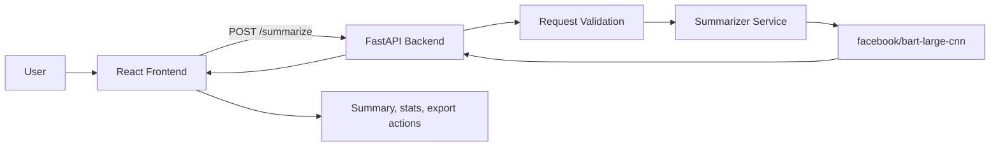

# AI Text Summarizer Project Documentation

This document explains how the application works end to end, from the browser UI through the FastAPI backend and into the BART summarization model.

## Overview

The project is a two-part text summarization system:

- The frontend is a React single-page app that collects input text, lets the user choose a summary style, and displays the result.
- The backend is a FastAPI service that validates requests, loads a Hugging Face BART model, generates summaries, and returns structured metadata.

The main production flow is:

## Repository Structure

- [backend/app.py](backend/app.py) defines the API routes and middleware.
- [backend/summarizer.py](backend/summarizer.py) loads the model and performs summarization.
- [backend/schemas.py](backend/schemas.py) defines the request and response models.
- [backend/validators.py](backend/validators.py) applies additional application-level validation.
- [frontend/src/App.jsx](frontend/src/App.jsx) composes the UI.
- [frontend/src/hooks/useSummarizer.js](frontend/src/hooks/useSummarizer.js) manages API state and submission logic.
- [frontend/src/services/api.js](frontend/src/services/api.js) contains the HTTP client for the backend.
- [frontend/src/components](frontend/src/components) contains the reusable UI pieces.
- [hf-space/app.py](hf-space/app.py) is a deployment-oriented variant of the backend for Hugging Face Spaces.

## Backend Architecture

### API Layer

The FastAPI application in [backend/app.py](backend/app.py) exposes two routes:

- `GET /` returns a simple health check payload with service name and version.
- `POST /summarize` accepts a summarization request and returns the generated summary plus metadata.

The app also enables CORS for all origins, methods, and headers. That keeps local development simple and allows the React frontend to call the API directly.

### Request and Response Models

The backend schema layer in [backend/schemas.py](backend/schemas.py) defines:

- `SummaryStyle`, an enum of supported styles: `concise`, `detailed`, `bullets`, `executive`, and `academic`.
- `SummarizeRequest`, which requires text input and accepts `max_length`, `min_length`, and `style`.
- `SummarizeResponse`, which returns the summary text and word-count metadata.

The request model already enforces important bounds:

- `text` must be at least 50 characters and at most 10,000 characters.
- `max_length` is constrained to 50-500.
- `min_length` is constrained to 10-200.
- `style` must be one of the enum values.

### Validation Layer

The application also performs runtime validation in [backend/validators.py](backend/validators.py):

- Empty or whitespace-only text is rejected.
- Text shorter than 20 words is rejected.
- Text longer than 2,000 words is rejected.
- `min_length` must be strictly less than `max_length`.

This means the backend has both schema-level validation and business-rule validation. Schema validation catches malformed requests early, while the custom validators enforce summarization-specific constraints.

### Summarization Service

The core summarization logic lives in [backend/summarizer.py](backend/summarizer.py).

#### Model Loading

`SummarizerService` lazily loads `facebook/bart-large-cnn` through the Hugging Face `pipeline` API. The model is cached in a module-level singleton returned by `get_summarizer()`, so the heavy model initialization happens once per process rather than on every request.

#### Style Handling

Each style has a prompt and a formatting function:

- `concise` returns the model output directly.
- `detailed` returns the model output directly.
- `bullets` converts the result into bullet points.
- `executive` adds an executive-summary header and key takeaway.
- `academic` adds academic framing and optional date or source context.

The model is prompted by prepending a style-specific instruction before the source text when the input is long enough for the prompt to matter.

#### Long-Text Strategy

The summarizer uses a staged approach:

1. Short texts of 400 words or fewer are summarized in one pass.
2. Longer texts are split into sentence-aware chunks of roughly 350 words.
3. Each chunk is summarized separately.
4. The chunk summaries are combined.
5. If the combined result is still too long, a final refinement pass runs.

This approach is what makes the backend usable on longer inputs without sending the entire document through a single model call.

#### Output Formatting

The post-processing helpers are intentionally style-specific:

- `_format_bullets()` splits prose into bullet items.
- `_format_executive()` adds a business-facing header and takeaway line.
- `_format_academic()` preserves research-oriented framing and extracts dates or publication cues.

### Error Handling

The `/summarize` route returns:

- `400` for validation failures.
- `500` for unexpected model or runtime errors.

The response body always uses a `detail` field for error messages, which the frontend reads directly.

## Frontend Architecture

### Application Shell

The React entry point is [frontend/src/index.js](frontend/src/index.js), which mounts `<App />` into the root element defined in [frontend/public/index.html](frontend/public/index.html).

The app-level structure in [frontend/src/App.jsx](frontend/src/App.jsx) is straightforward:

- `Header` displays the title and branding.
- `TextInput` collects the source text and user preferences.
- `SummaryOutput` renders either the summary or an error state.
- `LoadingSpinner` overlays the page while the request is in flight.

### State Management

All summarization state is owned by [frontend/src/hooks/useSummarizer.js](frontend/src/hooks/useSummarizer.js).

That hook tracks:

- `summary`
- `isLoading`
- `error`
- `originalLength`
- `summaryLength`
- `style`

It also provides:

- `generateSummary(text, maxLength, minLength, selectedStyle)` to trigger the API call.
- `clearSummary()` to reset the output state.

The hook performs the same minimum and maximum word-count checks as the backend before sending the request. That gives the user immediate feedback, while the backend remains the source of truth.

### API Client

The frontend HTTP client lives in [frontend/src/services/api.js](frontend/src/services/api.js).

Important behavior:

- It uses `REACT_APP_API_URL` when provided.
- It falls back to `http://localhost:8000` for local development.
- It sends a JSON `POST` request to `/summarize`.
- It sets a 60-second timeout via `AbortController`.
- It converts non-OK responses into readable JavaScript errors using the backend’s `detail` field.

The CRA `proxy` setting in [frontend/package.json](frontend/package.json) also points to `http://localhost:8000`, which helps local development when the frontend is served from the React dev server.

### Input Experience

The main text entry form is [frontend/src/components/TextInput/TextInput.jsx](frontend/src/components/TextInput/TextInput.jsx).

It provides:

- A large textarea for pasting source text.
- Live word and character counts.
- Five summary styles.
- Two range sliders for minimum and maximum summary length.
- A clear action that resets the form.

The component prevents submission unless the input text contains between 20 and 2,000 words.

### Output Experience

The result view is [frontend/src/components/SummaryOutput/SummaryOutput.jsx](frontend/src/components/SummaryOutput/SummaryOutput.jsx).

It supports two states:

- Error state, which shows a failure message and a retry button.
- Success state, which shows the summary, word counts, compression ratio, and action buttons.

The summary panel also supports:

- Copying the summary to the clipboard.
- Downloading the summary as a text file.
- Clearing the current result and starting over.

### Loading State

[frontend/src/components/LoadingSpinner/LoadingSpinner.jsx](frontend/src/components/LoadingSpinner/LoadingSpinner.jsx) renders a full-screen overlay while the backend request is pending. That makes the model latency visible and prevents duplicate submissions.

### Shared Utilities

The helper functions in [frontend/src/utils/helpers.js](frontend/src/utils/helpers.js) provide:

- Clipboard copying with a secure-context fallback.
- Downloading text as a `.txt` file.
- Word counting.

## End-to-End Request Flow

1. The user enters or pastes text into the frontend.
2. The user selects a style and adjusts min and max length if needed.
3. The frontend validates the word count before sending the request.
4. The hook calls the API client.
5. The backend validates the payload and business rules.
6. The backend loads or reuses the BART summarizer singleton.
7. The backend summarizes the text, applying style-specific formatting.
8. The frontend receives the JSON response and renders the result panel.

## Deployment Notes

### Local Development

The expected local ports are:

- Frontend: React dev server, typically port `3000`.
- Backend: FastAPI server on port `8000`.

### Environment Variables

Frontend configuration can be overridden with:

- `REACT_APP_API_URL` to point the browser app at a different backend base URL.

### Hugging Face Space Variant

The [hf-space/app.py](hf-space/app.py) implementation mirrors the main backend but is packaged as a deployment-friendly single file. The accompanying [hf-space/README.md](hf-space/README.md) and [hf-space/requirements.txt](hf-space/requirements.txt) indicate that this copy is intended for a hosted environment rather than local frontend/backend separation.

## Design and UX Summary

The frontend uses a dark, card-based layout with clear visual hierarchy:

- A branded header introduces the app.
- The input card centers the workflow around the source text.
- The output card separates successful results from errors.
- The loading overlay communicates that model inference is in progress.

The UI is responsive, and the mobile layout collapses the control grid to a single column for smaller screens.

## Practical Limitations

- The BART model is large and may take time to load on first request.
- Very long texts are chunked, but summarization quality still depends on the source structure and model limits.
- CORS is currently open to all origins, which is convenient for development but broad for a locked-down production environment.

## Source Files Worth Reading First

- [backend/app.py](backend/app.py)
- [backend/summarizer.py](backend/summarizer.py)
- [frontend/src/hooks/useSummarizer.js](frontend/src/hooks/useSummarizer.js)
- [frontend/src/services/api.js](frontend/src/services/api.js)
- [frontend/src/components/TextInput/TextInput.jsx](frontend/src/components/TextInput/TextInput.jsx)
- [frontend/src/components/SummaryOutput/SummaryOutput.jsx](frontend/src/components/SummaryOutput/SummaryOutput.jsx)
